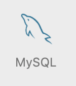
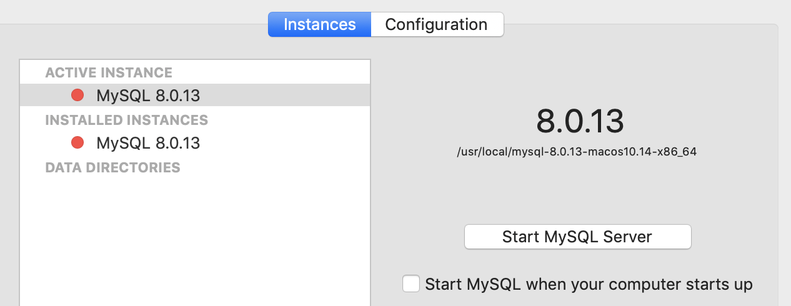
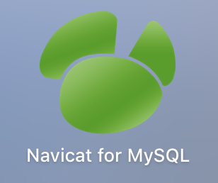

### 上手MySQL
------

>对于数据库的选择有很多，有收费的，有免费的，对于自学来说，最合适的莫过于**MySQL**，需要详细了解请访问[官网](https://www.mysql.com)

### 下载安装

1、访问官网进入[下载](https://dev.mysql.com/downloads/mysql/)


2、打开安装，下一步。。。设置初始密码，搞定！

### 服务的启动与停止

1、使用终端命令

```
//启动MySQL服务 
sudo /usr/local/mysql/support-files/mysql.server start

//停止MySQL服务 
sudo /usr/local/mysql/support-files/mysql.server stop
```
2、在系统偏好设置中有一个有MySQL选项，可以在这里手动启动与停止MySQL服务




### 图形化管理工具Navicat

1、为了方便操作，推荐使用`Navicat`进行数据库操作，当然也可以用终端操作，您随意



### 问题

> Can't connect to MySQL server on '127.0.0.1' (10061) 解决办法

用Navicat新建连接报错，检查过服务是正常开启，查询了很多解决方案，尝试很多遍，通过**修改配置文件**，得以成功解决。

注意区分Mac版MySQL与Windows版的MySQL配置文件扩展名不同: <br>
Mac下: my.cnf <br>
Windows下: my.ini

这里介绍MAC下安装Mysql找不到my.cnf配置文件的问题,并自己创建my.cnf文件

1. 在 `/etc`下 查找 my.cnf 文件，没有则新建
2. 添加内容，保存，重启MySQL服务，搞定！

```
  [client]
  default-character-set=utf8
  password   = your_password  
  port        = 3306  
  socket      = /tmp/mysql.sock   
  
  # Here follows entries for some specific programs  
  # The MySQL server  
  [mysqld]
  character-set-server=utf8
  init_connect='SET NAMES utf8
  port        = 3306  
  socket      = /tmp/mysql.sock  
  skip-external-locking  
  key_buffer_size = 16M  
  max_allowed_packet = 1M  
  table_open_cache = 64  
  sort_buffer_size = 512K  
  net_buffer_length = 8K  
  read_buffer_size = 256K  
  read_rnd_buffer_size = 512K  
  myisam_sort_buffer_size = 8M  
  character-set-server=utf8  
  init_connect='SET NAMES utf8' 
```


