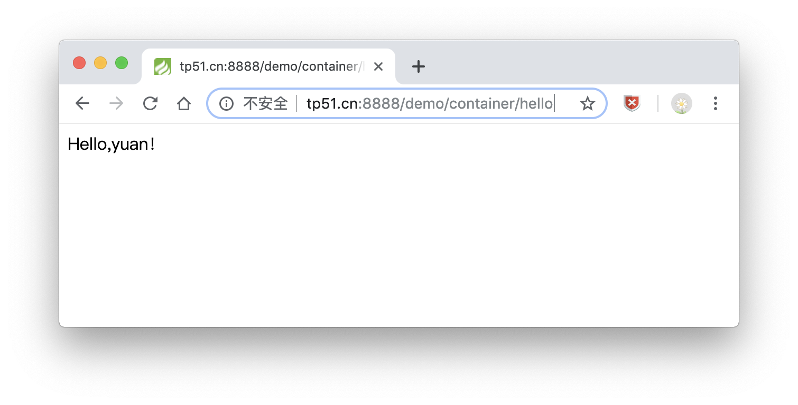
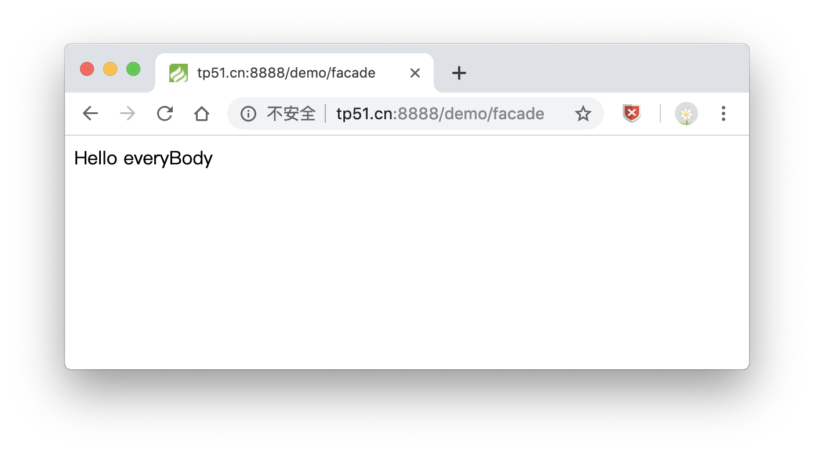
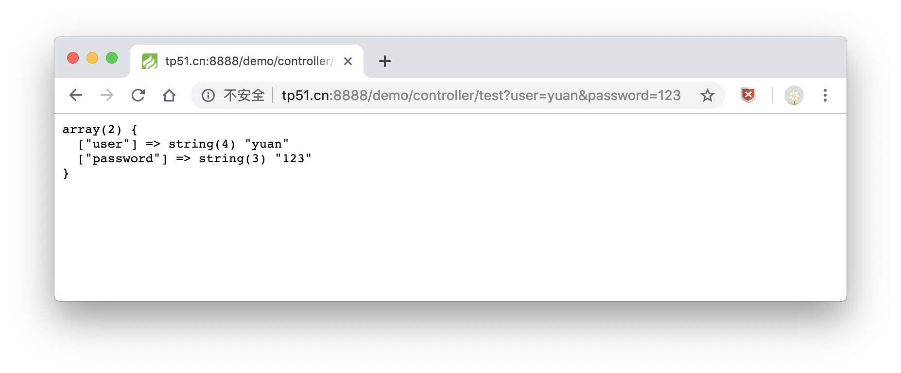
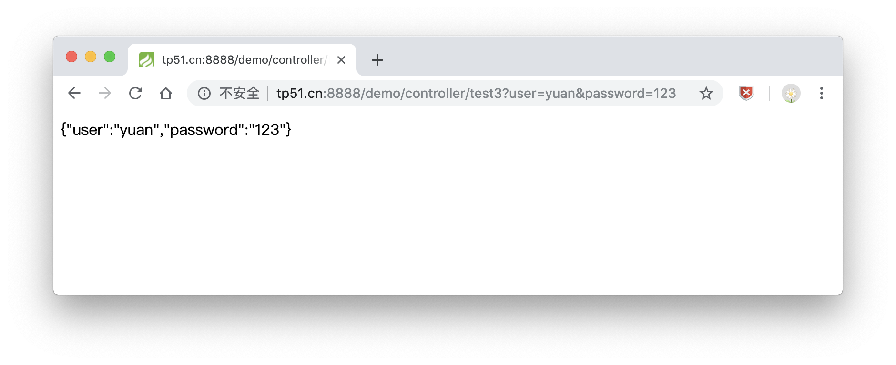

# 容器/依赖注入/静态代理/请求对象
---

### 一、容器与依赖注入的原理

1. 任何的URL访问，最终都是定位到控制器，由控制器中某个具体的方法去执行
2. 一个控制器对应着一个类，如果这些类需要进行统一管理，怎么办？
3. 容器来进行类管理，还可以将类的实例(对象)作为参数，传递给类方法，自动触发依赖注入

* 依赖注入：将对象类型的数据，以参数的方式传到方法的参数列表
* URL访问：通过GET方式将数据传到控制器指定的方法中，但是只能传字符串，数值
* 如果要传一个对象到当前方法中？怎么办？
* 依赖注入：解决了向类中的方法传递对象的问题

>依赖注入示例

```
protected $user;

public function __construct(UserModel $user)
{
    $this->user = $user;
}

/* 和上面是等价的
public function __construct(){
    $user = new UserModel();
    return $user->name;
}
*/

public function hello()
{
    return 'Hello,' . $this->user->name . '！';
} 
```



在`ThinkPHP`的设计中，`think\App`类虽然自身不是容器，但却是一个容器管理类，可以完成容器的所有操作。

`V5.1.14+`版本开始，应用类自身就是一个容器实例。

这里演示的是通过助手函数来进行绑定，当然也可以用`think\Container`操作
  
* 调用和绑定的标识必须保持一致（包括大小写）
* 你可以绑定一个类到容器中（第一个参数直接传入类名）
* 只要调用过一次后就会自动绑定
* 绑定的类标识可以自己定义（只要不冲突）
     
>容器绑定示例

```
public function bind()
{
    // 绑定类库标识
    bind('user','app\demo\model\UserModel');

    // 快速调用（自动实例化）
    $user = app('user');
    $user->name = '123';

    echo '$user->name , ' . $user->name . '！<br>';
    
    //容器中已经调用过的类会自动使用单例
    //除非你使用下面的方式强制重新实例化。
    //每次调用都会重新实例化
    $user = app('user',true);

    echo '$user->name , ' . $user->name . '！<br>';

    $user = app('user',['带参数实例'],true);

    echo '$user->name , ' . $user->name . '！';
}

```


>闭包绑定

```
/**
 * 绑定闭包
 * 可以把一个闭包方法绑定到容器中
 * \think\Container 方式
 */
public function bindClosure()
{
    \think\Container::set('sayHello', function ($name) {
        return 'hello,' . $name;
    });

    return \think\Container::get('sayHello',['name'=>'yuan']);
}
```


### 二、静态代理

门面(`Facade`)为容器中的类提供了一个静态调用接口，相比于传统的静态方法调用，带来了更好的可测试性和扩展性，你可以为任何的非静态类库定义一个`Facade`类。

系统已经为大部分核心类库定义了Facade，所以你可以听过Facade来访问这些系统类，当然也可以为你的应用类库添加静态代理。

>静态代理示例

创建示例类Facade.php

```
<?php

namespace app\demo\controller;

// use app\demo\model\UserModel;

class Facade
{
    public function index($name='yuan')
    {
        // $user = new UserModel();
        // return $user->sayHello('everyBody');

        /**
         * 如果静态调用一个动态方法，需要给当前的类绑定一个静态代理类
         */

         return \app\facade\UserModel::sayHello('everyBody');
    }
}
```

创建文件`app\facade\UserModel.php`


	
```
<?php

namespace app\facade;

class UserModel extends \think\Facade
{
    protected static function getFacadeClass()
    {
        return 'app\demo\model\UserModel';
    }
}
```

也可以修改`app\facade\UserModel.php`

```
<?php

namespace app\facade;

class UserModel extends \think\Facade
{

}
```

修改`app\demo\controller\Facade.php`

```
<?php

namespace app\demo\controller;

class Facade
{
    public function index($name='yuan')
    {
        
        /*如果没有在静态代理类中显示要指定要绑定的类名，就需要动态显示绑定一下
          \think\Facade::bind()
        */
        \think\Facade::bind('app\facade\UserModel','app\demo\model\UserModel');
        return \app\facade\UserModel::sayHello('everyBody');
    }
}
```

打印效果一样



### 三、请求对象

* 正常情况下，控制器不依赖于父类`Controller.php`
* 推荐继承于父类，可以很方便的使用在父类中封装好的一些方法和属性
* `Controller.php`没有静态代理
* 控制器中的输出，字符串全部用`return`返回，不要用`echo`
* 如果输出的是复杂类型，我们可以用`dump()`函数
* 默认输出的格式为`html`，可以指定为其他格式`json `
 
>调用方式
 
1. 传统的 `new Request`
2. 静态代理：`think\facade\Request`
3. 依赖注入：`Request $request`
4. 父类`Controller`中的属性`$request：$this->request`
 
>示例代码

```
class Controller extends \think\Controller
{
    //依赖注入
    public function test(Request $request)
    {
        dump($request->get());
    }

    //父类属性
    public function test2()
    {
        dump($this->request->get());
    }

    //静态代理
    public function test3()
    {
        return (json_encode(Request::get()));
    }
}
```

>示例效果



>返回json



### 总结

这一章讲了`容器/依赖注入/静态代理/请求对象`技术相关操作，

* `ThinkPHP5.1`中使用了`注册树模式`，这里的容器就是注册树模式，之前讲过应该很熟悉了。
* `依赖注入`就是将对象类型的数据，以参数的方式传到方法的参数列表，没什么高深的东西。
* `静态代理`为容器中的类提供了一个静态调用接口，相比于传统的静态方法调用，带来了更好的可测试性和扩展性
* `请求对象`介绍了四种方式获取请求参数

同时感谢[PHP中文网](http://www.php.cn) 的教学资源...

以上均是自学过程的积累，学到哪记到哪

原创文章，转载请注明出处，谢谢！